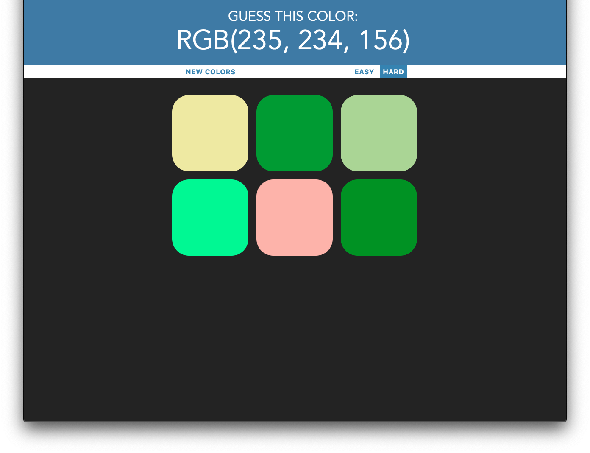

## ColorGame

### Description
- This game helps improve your understanding of the RGB-Colorcode.
- An RGB Color-Code will be shown in the title

- ######Goal
    - Guess the RGB Color-Code code by clicking on the correct color.
- *Difficulties*
    - Easy: 3 options
    - Hard: 6 optins
  
###### Goal
Guess the RGB Color-Code code by clicking on the correct color.

###### Difficulties:
- Easy: 3 options
- Hard: 6 optins

### Current State

###### To-Do
- 6 options = medium
- 9 options = hard
- 16 options = god-mode
- ⚠️beautify⚠️

